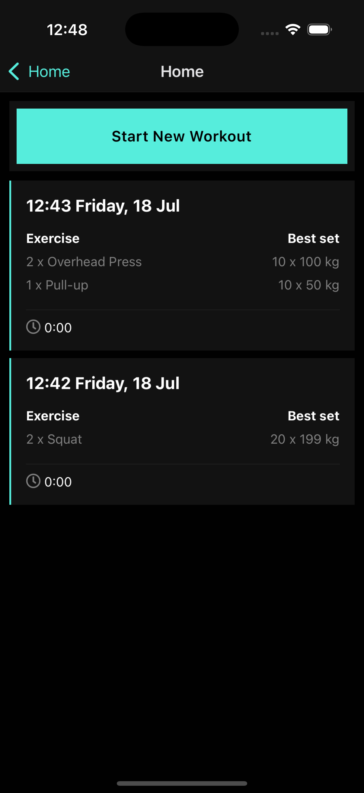
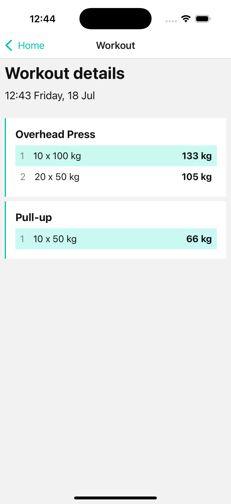
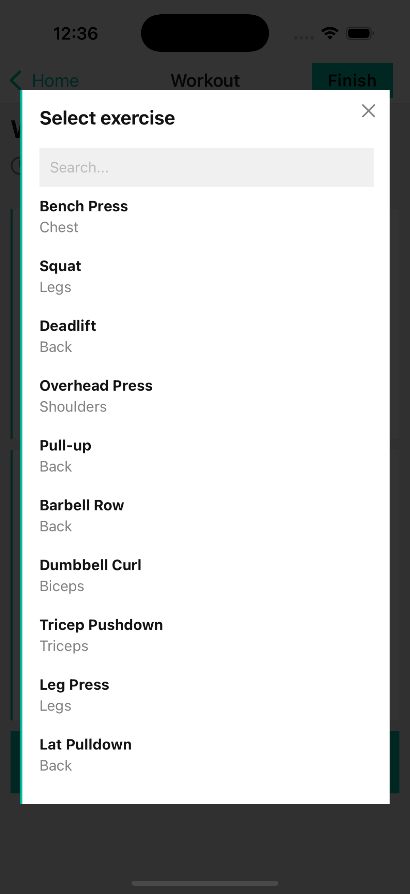
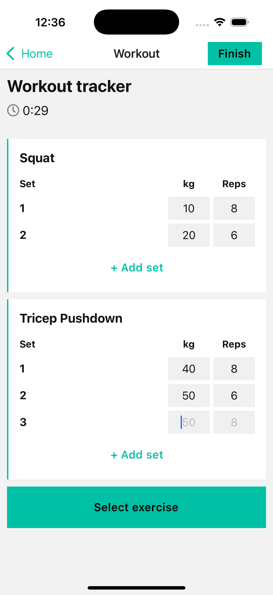

# 💪 Fitness App

Une application mobile de suivi d'entraînement développée avec React Native et Expo.

## 📱 Fonctionnalités

- **Gestion des workouts** : Créer, démarrer et suivre vos séances d'entraînement
- **Bibliothèque d'exercices** : Large sélection d'exercices prédéfinis
- **Tracking des sets** : Enregistrement des répétitions, poids et calcul du 1RM
- **Historique complet** : Visualisation de vos entraînements passés
- **Interface moderne** : Design adapté iOS/Android avec support du mode sombre

## 📸 Screenshots

<div align="center">
  
  
  
  
</div>

## 🛠️ Technologies utilisées

### Core

- **React Native** `0.74.5` - Framework mobile cross-platform
- **Expo** `~51.0.28` - Plateforme de développement
- **TypeScript** `^5.1.3` - Typage statique

### Navigation & UI

- **Expo Router** `~3.5.23` - Navigation basée sur le système de fichiers
- **React Native Gesture Handler** - Gestion des gestes
- **React Native Safe Area Context** - Gestion des zones sécurisées

### État & Données

- **Zustand** `^5.0.6` - Gestion d'état légère et performante
- **Immer** `^10.1.1` - Mises à jour immutables simplifiées
- **dayjs** `^1.11.13` - Manipulation des dates

### Utilitaires

- **Expo Crypto** - Génération d'IDs sécurisés
- **Expo Constants** - Accès aux constantes système

## 📂 Architecture du projet

```
src/
├── app/                    # Screens avec Expo Router (3 écrans)
│   ├── index.tsx          # Page d'accueil - Liste des workouts
│   ├── _layout.tsx        # Layout principal
│   └── workout/
│       ├── current.tsx    # Workout en cours
│       └── [id].tsx       # Détail d'un workout
├── components/            # Composants réutilisables
│   ├── general/          # Composants génériques (Card, Button, Themed)
│   ├── workouts/         # Composants workout (ListItem, ExerciseItem)
│   └── logger/           # Composants de logging (SetItem, Modal)
├── store/                # Gestion d'état Zustand
├── services/             # Logique métier (workout, exercise, set)
├── types/               # Modèles TypeScript
├── data/                # Données statiques (exercices, workouts démo)
├── constants/           # Constantes (couleurs, etc.)
└── utils/               # Utilitaires (temps, etc.)
```

## 🚀 Démarrage rapide

### Prérequis

- Node.js (version 18+)
- npm ou yarn
- Expo CLI
- Expo Go app (pour tester sur mobile)

### Installation

```bash
# Installer les dépendances
npm install

# Démarrer le serveur de développement
npm start

# Ou pour une plateforme spécifique
npm run ios
npm run android
npm run web
```

### Développement

1. Scannez le QR code avec Expo Go
2. L'app se recharge automatiquement lors des modifications
3. Utilisez les dev tools Expo pour debugger

## 📊 Données & Modèles

### Modèles principaux

- **Workout** : Séance d'entraînement avec timestamps
- **Exercise** : Exercice lié à un workout
- **ExerciseSet** : Set individuel avec reps/poids/1RM

### Base de données

- Stockage local avec persistance (à implémenter)
- Données démo pour développement
- Services dédiés pour chaque entité

## 🎨 Design System

- **Thèmes** : Support automatique clair/sombre
- **Composants** : Design system cohérent
- **Navigation** : UX optimisée avec gestes natifs
- **Responsive** : Adaptation tablette iOS

## 📈 Fonctionnalités avancées

- Calcul automatique du One Rep Max (1RM)
- Gestion des états de workout (en cours/terminé)
- Interface modale pour sélection d'exercices
- Suppression des sets/exercices non remplis
- Historique détaillé avec métriques
